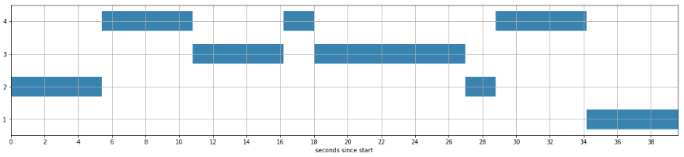

# Speaker_Verification
Tensorflow implementation of generalized end-to-end loss for speaker verification

### Explanation
- This code is the implementation of generalized end-to-end loss for speaker verification (https://arxiv.org/abs/1710.10467)
- This paper improved the previous work (End-to-End Text-Dependent Speaker Verification, https://arxiv.org/abs/1509.08062)

### Speaker Verification
- Speaker verification task is 1-1 check for the specific enrolled voice and the new voice. This task needs higher accuracy than speaker identification which is N-1 check for N enrolled voices and a new voice. 
- There are two types of speaker verification. 1) Text dependent speaker verification (TD-SV). 2) Text independent speaker verification (TI-SV). The former uses text specific utterances for enrollment and verification, whereas the latter uses text independent utterances.
- Each forward step in this paper, similarity matrix of utterances are calculated and the integrated loss is used for objective function. (Section 2.1)


### Files
- configuration.py  
Argument parsing  

- data_preprocess.py  
Extract noise and perform STFT for raw audio. For each raw audio, voice activity detection is performed by using librosa library.

- utils.py   
Containing various functions for training and test.  

- model.py  
Containing train and test function. Train fucntion draws graph, starts training and saves the model and history. Test function load 
variables and test performance with test dataset.  

- main.py  
When this file is implemented, training or test begins.
```
if dataset is prepared, 
python main.py --train True --model_path where_you_want_to_save                 # training
python main.py --train False --model_path model_path used at training phase     # test
```

### Data
- I cannot obtain proper speaker verifiaction dataset. (The authors of the paper used their own Google dataset.)
- For implementation, I used VTCK public dataset(CSTR VCTK Corpus 
, http://homepages.inf.ed.ac.uk/jyamagis/page3/page58/page58.html) and noise added VTCK dataset(Noisy speech database for training speech enhancement algorithms and TTS models, https://datashare.is.ed.ac.uk/handle/10283/1942)
- VCTK dataset includes speech data uttered by 109 native speakers of English with various accents. 
- For TD-SV, I used the first audio file of each speaker which says "Call Stella". Each training and test data, I added random noise which is extracted from noise added VTCK dataset. 
- For TD-SI, I used random selected utterances from each speaker. Blank of raw audio files are trimmed and then slicing is performed.  

### Pre-trained Model
Pre-trained Model on the data Voxceleb 1 & Voxceleb 2 https://github.com/Honghe/Speaker_Verification/releases/tag/v0.0.1
With configuration.py by following the Google paper:
```
# Data Preprocess Arguments
data_arg = parser.add_argument_group('Data')
data_arg.add_argument('--sr', type=int, default=16000, help="sampling rate")
# Model Parameters
model_arg = parser.add_argument_group('Model')
model_arg.add_argument('--hidden', type=int, default=768, help="hidden state dimension of lstm")
model_arg.add_argument('--proj', type=int, default=256, help="projection dimension of lstm")
# Training Parameters
train_arg = parser.add_argument_group('Training')
train_arg.add_argument('--N', type=int, default=48, help="number of speakers of batch")
train_arg.add_argument('--M', type=int, default=10, help="number of utterances per speaker")
```
Performance:
trained loss is 120.  
Tested on file `./samples/diarizationExample_sr16k.wav`(4 speaker in the wild)


Tested on CVTK with `--N=80 --M=5`
```
[[[ 8.66e-01 -1.08e-02 -2.82e-02 ...  4.06e-03  1.58e-01  1.58e-01]
  [ 7.89e-01 -5.59e-02  2.18e-02 ...  6.14e-02  2.28e-01  1.83e-01]
  [ 6.54e-01 -3.43e-02 -5.62e-03 ...  1.08e-01  1.89e-01  1.11e-01]
  [ 7.19e-01  4.55e-03 -1.16e-01 ... -7.73e-04  4.39e-02  7.29e-02]
  [ 6.67e-01  4.63e-02 -4.81e-02 ... -1.99e-02  1.80e-01  1.50e-01]]

 [[-1.24e-01  7.48e-01  7.53e-02 ...  2.29e-02  1.38e-02  3.45e-02]
  [-7.15e-02  5.56e-01  8.16e-02 ...  4.00e-02  7.44e-02  7.17e-02]
  [-3.35e-02  7.32e-01  1.37e-01 ...  8.41e-02  1.17e-01  1.06e-01]
  [-1.49e-02  7.14e-01  7.09e-02 ...  2.04e-01  2.50e-02  4.80e-02]
  [-3.73e-02  7.62e-01  1.08e-01 ...  1.89e-01  7.23e-02  9.35e-02]]

 [[-9.52e-02  1.04e-02  6.26e-01 ...  1.19e-01  3.03e-01  3.59e-01]
  [ 1.56e-02  1.13e-01  8.74e-01 ... -2.86e-02  4.66e-01  3.80e-01]
  [ 1.64e-01 -8.73e-02  6.17e-02 ... -4.09e-02  2.50e-01  9.64e-02]
  [ 1.17e-01  1.16e-01  8.49e-01 ... -4.00e-02  5.09e-01  4.11e-01]
  [ 1.11e-01  7.51e-02  8.21e-01 ...  3.65e-02  4.11e-01  2.73e-01]]

 ...

 [[ 3.71e-02  2.93e-01 -7.90e-02 ...  8.61e-01 -1.99e-02 -3.95e-02]
  [ 9.90e-02  5.34e-01 -2.15e-02 ...  7.02e-01 -1.72e-02  6.51e-03]
  [ 8.93e-02  2.94e-01 -3.02e-02 ...  7.60e-01  2.59e-02  4.67e-02]
  [ 1.21e-02  4.14e-01 -8.09e-02 ...  7.22e-01  1.62e-02 -4.05e-02]
  [-1.25e-02  4.55e-01 -7.21e-02 ...  7.69e-01 -5.59e-03 -4.62e-02]]

 [[ 1.28e-01 -1.55e-03  6.15e-01 ... -2.38e-02  8.96e-01  6.46e-01]
  [ 3.70e-02  4.44e-03  4.19e-01 ... -3.03e-02  8.74e-01  5.60e-01]
  [ 5.83e-02  3.26e-03  4.38e-01 ... -4.00e-02  9.19e-01  5.71e-01]
  [ 9.15e-02  6.34e-03  5.59e-01 ... -2.93e-02  8.74e-01  5.39e-01]
  [ 1.27e-01  2.43e-02  4.06e-01 ... -5.71e-02  8.31e-01  5.68e-01]]

 [[ 1.12e-01  3.21e-02  5.09e-01 ... -3.32e-02  5.23e-01  8.77e-01]
  [ 1.05e-01  5.14e-02  3.04e-01 ... -3.94e-02  6.41e-01  8.35e-01]
  [ 1.22e-01  7.97e-02  3.79e-01 ... -6.28e-02  6.45e-01  8.58e-01]
  [ 1.24e-01  7.59e-02  4.88e-01 ... -4.10e-02  7.71e-01  8.30e-01]
  [ 2.43e-01  2.86e-02  4.00e-01 ... -1.19e-02  5.76e-01  8.53e-01]]]

EER : 0.035 (thres:0.580, FAR:0.036, FRR:0.035)
```

### Results
I trained the model with my notebook cpu. Model hyperpameters are followed by the paper :3-lstm layers with 128 hidden nodes and 64 projection nodes (Total 210434 variables), 0.01 lr sgd with 1/2 decay, l2 norm clipping with 3. To finish training and test in time, I use smaller batch (4 speakers x 5 utterances) than the paper. I used about 85% of dataset for training and else for test. Only softmax loss is used, but I made contrast loss code too. In my cpu, it takes less than 1s for 40 utterances embedding.

1) TD-SV  
For each utterance, random noise is added each forward step. I test the model after 60000 iteration. Equal Error Rate(EER) is 0. For small population, the model performs well. 


Below figure contains Similarity matrix and EER, FAR, FRR.
Each matrix means each speaker. If we call the first matrix as A (5x4), A[i,j] means the first speaker's ith vertification utterance cos similarity with jth speaker enrollment.


2) TI-SV  
Random selected utterances are used. I test the model after 60000 iteration. Equal Error Rate(EER) is 0.09.  


